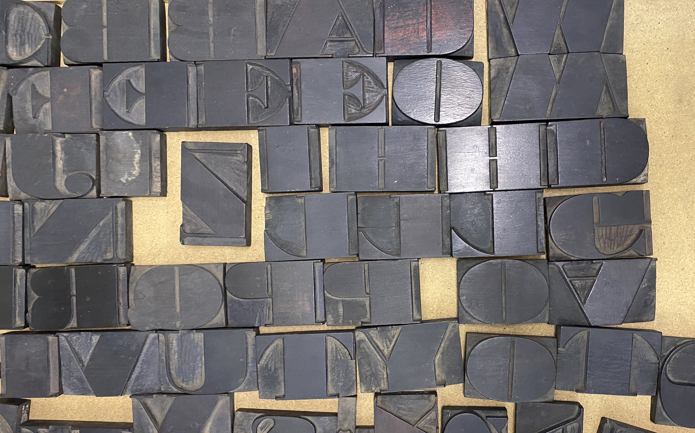
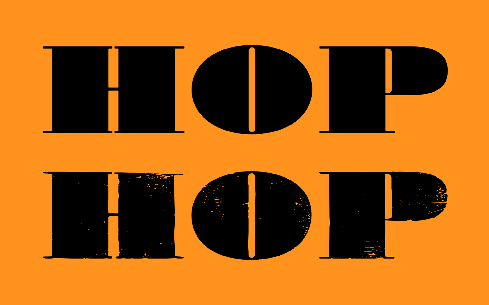

# Armidale

_Armidale_ is a digital revival of a well-worn ‘Fat Face’ Roman wood type set currently living at the [Museum of Printing](https://www.neram.com.au/visit/museum-of-printing/), [New England Regional Art Museum](https://www.neram.com.au) (NERAM) in [Armidale](https://www.visitnsw.com/destinations/country-nsw/armidale-area), regional Australia. The set has warped surfaces and some finer details broken during its past life as a working letterpress typeface. Due to this condition, any contemporary impressions contain a great deal of texture unique to this set. 

As with all manufactured metal and wood type used in Australia during the late 19th and early 20th centuries, this typeface is an import, not a local design. It is possibly [Sixteen Line Roman](https://www.instagram.com/p/CrT07BFLu9V/) circa 1865, distributed by W.H. Bonnewell & Co., London. However, while the origin of the typeface is not Australian, the physical type sorts are intertwined with our colonial printing history. This typeface revival project extends Olocco and Patané’s ‘synthetic’ and ‘literal’ approaches to [type revivals](https://www.designingtyperevivals.com) by embedding a sense of place and time into the outcome. The revival aims to recreate these particular letterforms’ tactile, well-worn, and damaged nature—infusing the digital design outcome with its history. 

The digital typeface uses variable type technology to embed a ‘time’ axis, allowing users to slide across time—from crisp and newly imported to worn and forgotten letterforms.

The early history of this project and initial proof of concept design was presented at the ATypI Brisbane 2024 conference: [presentation recording](https://youtu.be/CuvvMv7f3SM?si=Oj_JfN9PTqk59siu).

## About the Designer

[David Sargent](https://davidsargent.com.au) is an Australian designer and educator living and working on Jagera and Turrbal land. 

He is Creative Director of [Liveworm](https://liveworm.com.au), a work-integrated learning incubator within the [Queensland College of Art & Design, Griffith University](https://www.griffith.edu.au/arts-education-law/queensland-college-art-design). Liveworm operates as a working design studio for students to engage with a broad range of ‘real world’ projects for not-for-profit, cultural, educational, and small to medium commercial clients. 

As a design practitioner, David is interested in how creative practice can engage, communicate, and spark social change. His studio practice focuses on typography, expressive lettering, and disruptive augmented reality, with creative works exhibited in Australian and international galleries. He releases typefaces under the moniker [Bolt Cutter Type](https://boltcuttertype.com).
      

## Changelog

**July 2026. Version 0.200**
* Additional characters scanned
* Additional characters drawn

**April 2024. Version 0.100**
* Proof of concept 'HOP' completed
* Initial progress presented at ATypI 2024 Brisbane conference

## License

This Font Software is licensed under the SIL Open Font License, Version 1.1.
This license is available with a FAQ at
https://scripts.sil.org/OFL

## Repository Layout

This font repository structure is inspired by [Unified Font Repository v0.3](https://github.com/unified-font-repository/Unified-Font-Repository), modified for the Google Fonts workflow.
